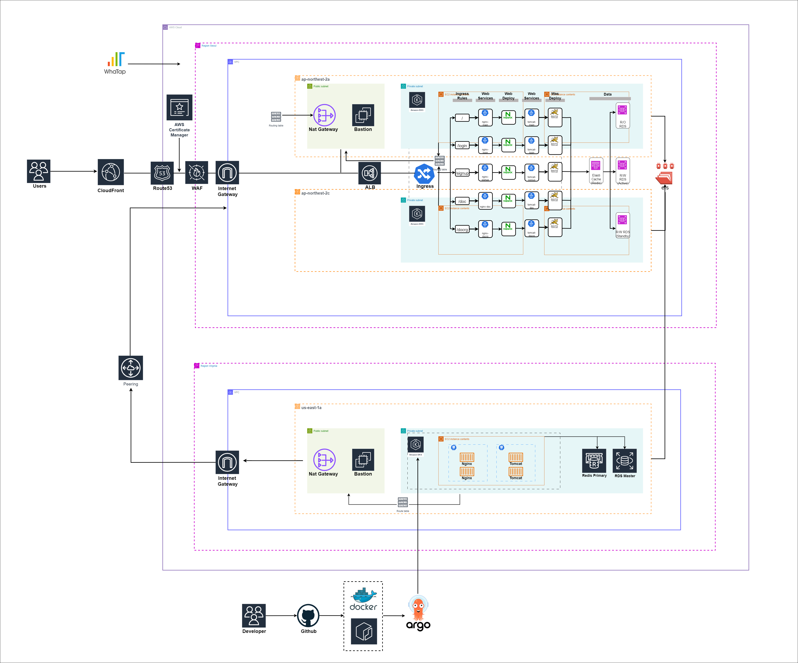
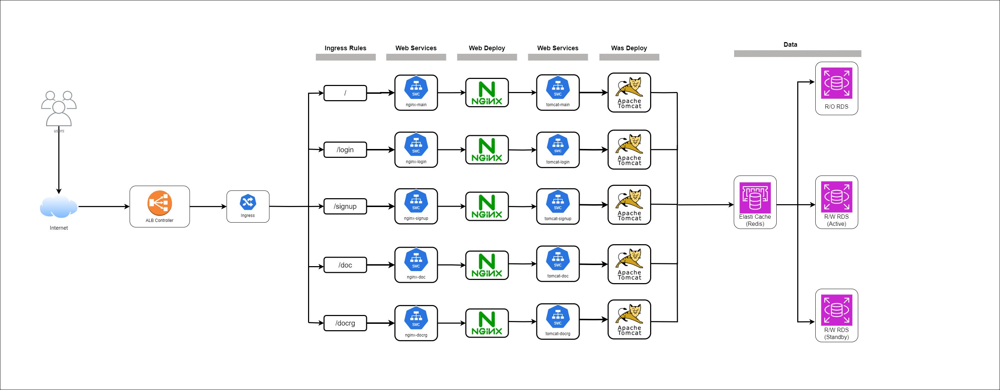
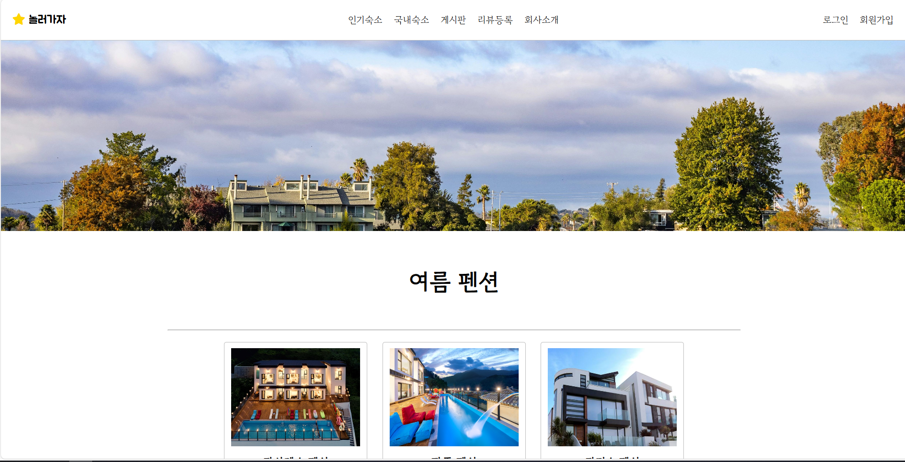
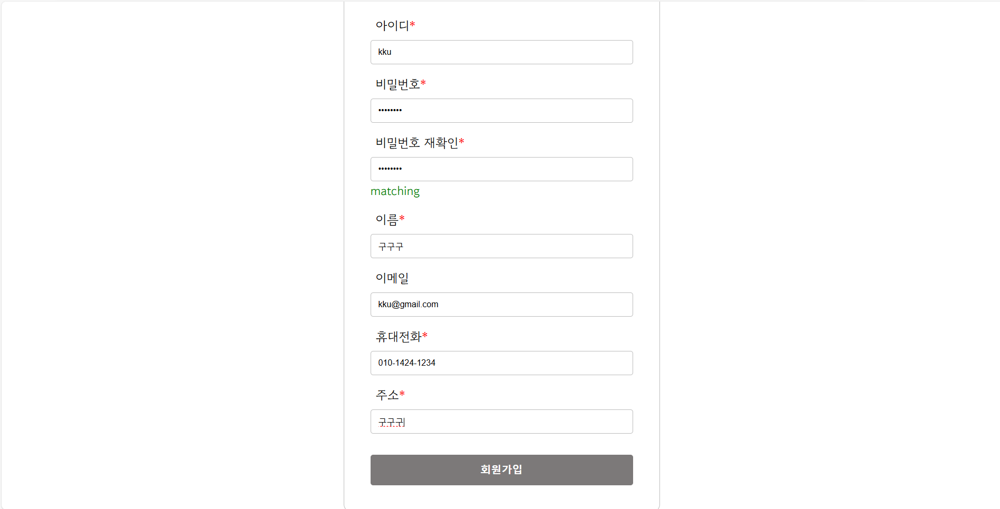
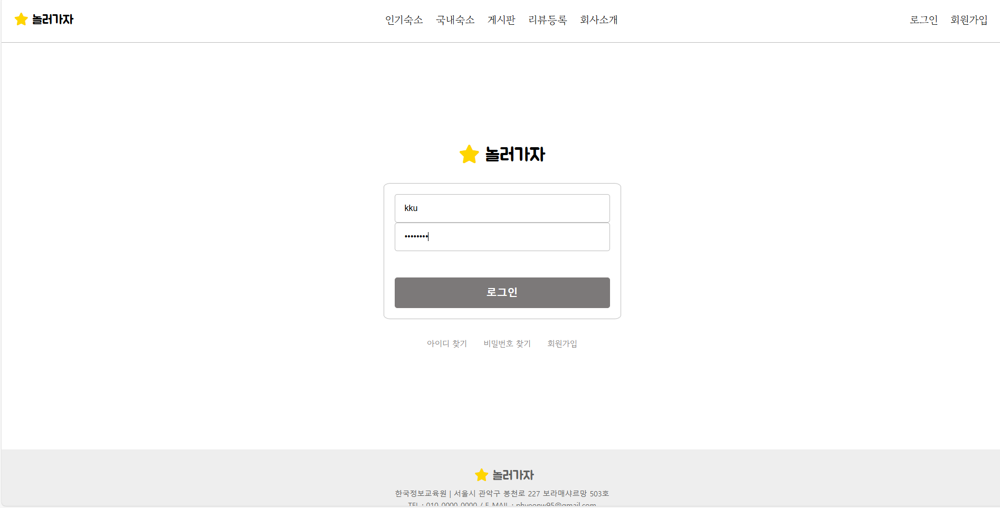
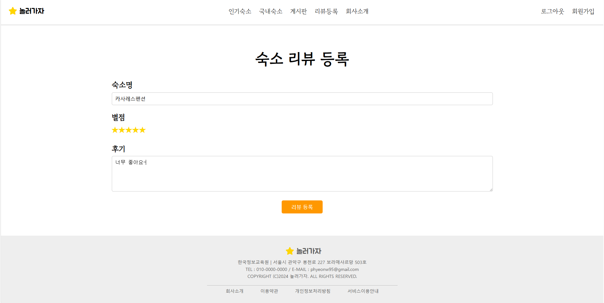

# team-3rd
한정교 second project 
## ✈ 배포주소

개발 버전 : version 1.0.0.0  
도메인 주소 : www.noljago.store  

## ✌️버전
| Version | Description | Date |
| --- | --- | --- |
| 0.1.1 | - Frontend 서버 구축 | 2024.08.23 |
| 0.1.2 | - Backend 서버 구축 | 2024.08.28 |
| 1.0.0 | - 서버 연동 완료 | 2024.08.30 |

## 🧑‍💻팀원 소개

| 이름 | 장정원 | 황기창 |
| :------------: | :------------: | :------------: |
|  |  |  |
| 깃허브 | [@kku9](https://github.com/kku9) | [@Hwang-gi](https://github.com/Hawng-gi) |
| 역할 | Project Leader | Technology Leader|
|  |  |  |  |

| 이름 | 박현우 | 박지영 |
| :------------: | :------------: | :------------: |
|  | |  |
| 깃허브 | [@hyeeonwoo](https://github.com/hyeeonwoo) | [@jiyoung0226](https://github.com/jiyoung0226) |
| 역할 | Engineer | Engineer |

## 📌 프로젝트 소개

### 프로젝트 기획 배경

현대 사회에서 일과 생활의 균형을 유지하는 것은 점점 더 중요한 과제로 떠오르고 있습니다. 특히 바쁜 도시 생활 속에서 잠시라도 벗어나 자연 속에서 휴식을 취하려는 사람들의 수요는 꾸준히 증가하고 있습니다. 여름은 이러한 휴식을 취하기에 가장 적합한 계절 중 하나로, 많은 사람들이 이 시기를 활용해 다양한 장소로 바캉스를 떠납니다. 그러나 매년 여름마다 원하는 숙소를 찾고 예약하는 과정에서 발생하는 어려움은 많은 이들에게 스트레스를 유발합니다.

이번 프로젝트는 사용자들이 보다 쉽고 편리하게 여름 휴가를 계획할 수 있도록 지원하기 위해 기획되었습니다. 본 프로젝트는 사용자의 편의를 최우선으로 하여, 직관적인 사용자 인터페이스와 필터링 기능, 해외와 국내 숙소 정보 제공, 그리고 직접 경험한 사용자의 리뷰를 통해 사용자가 최적의 숙소를 찾고 예약할 수 있도록 설계되었습니다.

특히, 여름철 인기 있는 휴가지와 관련된 다양한 숙소 옵션을 집중적으로 제공함으로써, 사용자들이 한정된 시간 내에 최적의 숙소를 선택할 수 있도록 돕는 것을 목표로 합니다.
결론적으로, 이 프로젝트는 여름 휴가를 계획하는 모든 이들에게 보다 쾌적하고 스트레스 없는 예약 경험을 제공함으로써, 궁극적으로 더 많은 사람들이 여름의 소중한 시간을 즐길 수 있도록 기여하는 것을 목표로 홈페이지를 제작하게 되었습니다.

## 🛠기술 스택

<table>
<tr>
 <td align="center">언어</td>
 <td>
  
  
   	 
  
 </td>
</tr>
	
<tr>
 <td align="center">프레임워크</td>
 <td>
   
</tr>

<tr>
 <td align="center">인프라</td>
 <td>
  
  
	
  
  
  
  
  
  
<tr>
 <td align="center">협업툴</td>
 <td>
    
    

   
 </td>
</tr>
<tr>
 <td align="center">기타</td>
 <td>
     
</tr>
</table>

## 🧱아키텍처

## 🗂PAGE
--PAGE
	
	

